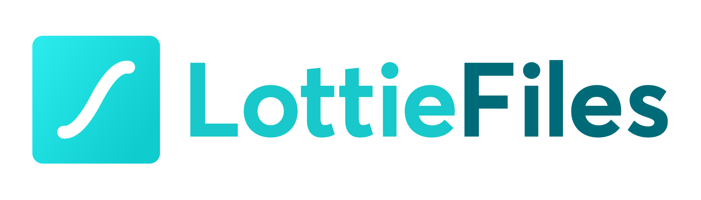

# Smart Budget

An app to list your income and expenses using [React.js](https://reactjs.org/), [Typescript](https://www.typescriptlang.org/) it also uses CSS-in-JS with [Styled-Components](https://styled-components.com/) [Mirage.js](https://miragejs.com/) to mock an API, [Formik](https://formik.org/)

<p>&nbsp;</p>

<p align="center" justify-content="center">



</p>

<p>&nbsp;</p>

The application can list your expenses, income and it calculates automatically and it shows the total funds and if it is positive the total gets green and if the balance is negative it gets red to emphasize that you are in debt. It has an animation in case there are no transactions. When you click add transaction it opens up a popup card and it has validation using Formik to prevent the user from adding empty fields.

<p>&nbsp;</p>

This is a preview of the application

<br/>


<br/>

# Installation

After downloading you should install the missing packages and dependencies

using NPM: 

```sh
npm install
```
using Yarn
```sh
yarn add
```

<br/>


# License
© Feito com muito &#10084; por [Ramon Pereira](https://www.linkedin.com/in/ramon-pereira88/) 🤝


